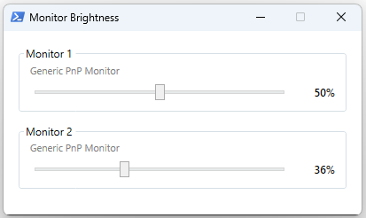

# Apple Cinema Display Brightness Control for Windows

Control the brightness of an Apple Cinema Display (and other DDC/CI-capable monitors) on Windows.

## Requirements

- Windows 10 or 11
- Windows PowerShell 5.1 (pre-installed on all modern Windows systems)
- The monitor connected via **DisplayPort or Mini DisplayPort** — DDC/CI signals are often stripped by HDMI or active adapters

## Setup

Allow local scripts to run (one-time, in an elevated PowerShell):

```powershell
Set-ExecutionPolicy -Scope CurrentUser -ExecutionPolicy RemoteSigned
```

## Usage

### GUI (recommended)

```powershell
.\MonitorBrightness-UI.ps1
```

Opens a small window with one brightness slider per detected monitor. Changes apply immediately as you drag the slider.



### Command line

```powershell
# List all monitors and their current brightness
.\Set-MonitorBrightness.ps1 -List

# Set brightness on all monitors (0–100)
.\Set-MonitorBrightness.ps1 -Brightness 60

# Set brightness on a specific monitor only
.\Set-MonitorBrightness.ps1 -Brightness 60 -Monitor 1
```

## Background

Apple Cinema Displays expose brightness control via the [DDC/CI](https://en.wikipedia.org/wiki/Display_Data_Channel) protocol. macOS handles this natively, but Windows provides no built-in UI for it. These scripts talk directly to the Windows Monitor Configuration API (`dxva2.dll`) to read and set brightness over DDC/CI.

Tested on:
- Apple Cinema Display 27" (A1316, Mini DisplayPort)
- Apple Thunderbolt Display 27" (A1407)
- Samsung Odyssey G5A

Should work with any DDC/CI-capable external monitor.


## Troubleshooting

**Monitor not detected / `[SKIP] DDC/CI not supported`**

- Make sure the display is connected via a passive Mini DisplayPort → DisplayPort cable. Active adapters (especially Mini DP → HDMI) often block DDC/CI signals.
- On some systems, DDC/CI must be enabled in the monitor's OSD menu. Apple Cinema Displays have no OSD, so this is not an issue there.

**Script won't run**

Run the `Set-ExecutionPolicy` command from the Setup section above.

**Brightness changes but reverts**

Some GPU drivers (notably AMD) periodically reset DDC/CI values. Running the script again will restore your setting.

## License

MIT
